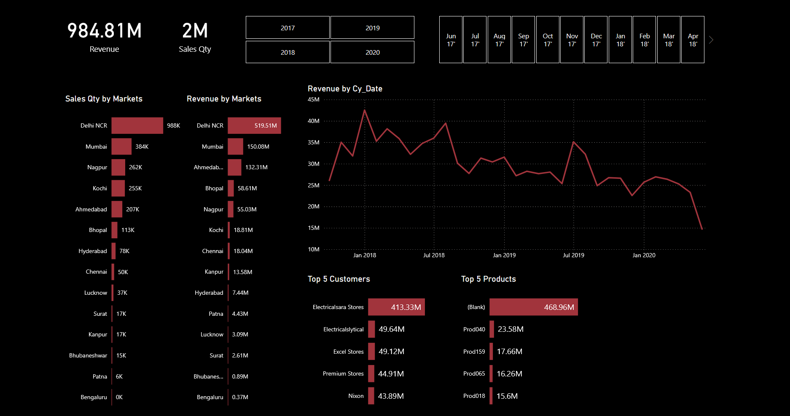

# 📊 Sales Data Analysis Dashboard

This project presents an interactive Power BI dashboard built on top of a sales database. The goal is to analyze sales performance, customer behavior, and product trends using clean, relational data and powerful visualizations.

---

## 🗃️ Dataset Overview

The dashboard is powered by a relational sales dataset with the following tables:

- **customers** — Customer details (`customer_code`, `customer_name`)
- **products** — Product details (`product_code`, `product_type`)
- **transactions** — Sales transactions (`transaction_id`, `order_date`, `sales_qty`, `sales_amount`, etc.)
- **markets** — Market region data (`markets_code`, `markets_name`, `zone`)
- **date** — Calendar information (`date`, `month_name`, `month_number`, `year`, etc.)

---

## 🧹 Data Cleaning & Modeling

Data preparation was done in **Power Query Editor** with the following steps:

- Verified referential integrity between transactions and lookup tables (e.g., products, customers, markets)
- Identified and fixed inconsistent `product_type` values (e.g., case mismatch, trailing spaces)
- Checked for missing `product_code`, `market_code` references
- Created relationships between tables using primary and foreign keys
- Added calculated columns and measures in DAX for further insights

---

## 📊 Key Metrics & KPIs

The dashboard includes the following metrics:

- ✅ Total Transactions
- 🛍️ Sales Quantity by Product Type
- 📈 Revenue Trends by Month
- 🌍 Customer Count per Zone
- 🥇 Top 3 Most Sold Products
- 🚫 Missing Data Checks (e.g., unmatched codes)

---

## 🔎 Insights Extracted

- **Own Brand** products generate the majority of transactions.
- **South Zone** holds the highest number of active customers.
- All `market_code` and `product_code` references are valid — the data is clean.
- Clear monthly seasonality observed in sales volume.

---

## 🚀 Demo

Below is a snapshot of the dashboard showing interactive visualizations and KPIs built using DAX and Power Query.

---

## 🛠️ Tools Used

- **Power BI Desktop**
- **DAX (Data Analysis Expressions)**
- **Power Query (M Language)**
- **SQL (for source querying and integrity checks)**

---

## 📁 File Included

- `SQL project.pbix` — The full Power BI report file

---

## 📌 How to Use

1. Open `SQL project.pbix` in Power BI Desktop
2. Refresh the data if connected to a local or SQL Server database
3. Explore the dashboard pages and interact with slicers and filters

---

## 📬 Contact

Made with ❤️ by Aamir Bin Raheem  
📧 aamirraheem6@gmail.com  
🔗 [GitHub: Aamir-Raheem](https://github.com/Aamir-Raheem)
